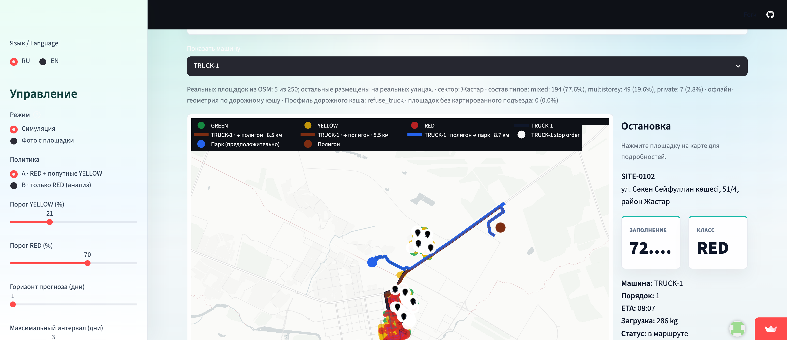

# ♻️ EcoRoute AI

**Predictive waste collection & route optimization for smart cities.**

EcoRoute AI simulates how quickly collection sites fill, classifies mandatory and opportunistic stops, and builds capacity- and shift-safe truck routes with landfill dump trips. The current 250-site pilot world is polygon-validated inside the residential `Жастар` catchment and Astana's multi-part Baikonur district boundary.

🔗 **Live V2.3 demo:** [ecoroute-ai-baikonur.streamlit.app](https://ecoroute-ai-baikonur.streamlit.app/)  ·  🏙️ **Built for:** Astana Innovations Accelerator — Ecology & Urban Environment



---

## The problem

Cities run waste trucks on **fixed routes** — the same loop every day, emptying bins that are only half full while busy areas overflow. That wastes fuel, time, and municipal budget, and adds avoidable emissions.

## The solution

EcoRoute AI replaces the fixed schedule with a demand-driven one, in four steps:

1. **Project** tomorrow's fill from each site's stable synthetic accumulation rate.
2. **Prioritise** RED stops as mandatory and evaluate YELLOW stops by detour per m³.
3. **Optimise** per-truck routes with OR-Tools, capacity resets at the landfill, and shift limits.
4. **Compare** fixed, fixed-naive, predictive, and RED-only policies over 30 days.

A dispatcher sees the full plan on one map before the shift, tunes how aggressive collection is, and exports the exact route order.

## Results (latest 30-day simulation)

| Metric | Value |
|---|---|
| World | 250 sites in the residential `Жастар` catchment; 250/250 inside both the committed sector polygon and Baikonur district |
| Sector selection | Ranked first with 119 nearby `building=apartments|residential|house` records |
| Area-type mix | mixed 77.6%, multistorey 19.6%, private 2.8%, commercial 0% — 100% residential/mixed |
| Coordinate provenance | **5 of 250 real OSM waste records; the other 245 are placed on real streets** |
| Distance source | Committed OSRM road cache: full 252×252 matrix, 100% of default 30-day route edges covered offline |
| Predictive max-interval violations | 0 |
| Fixed max-interval violations | 0 — the baseline is now a compliant, idealised calendar |
| Predictive overflow events vs fixed | 153 vs 399 (-61.7%) |
| Automatically selected YELLOW detour budget | 0 m/m³; no nonzero tested point improves both distance and overflow, so the report explicitly flags the yellow rule as inert |
| Fleet adequacy | No tested operating point reaches zero overflow; the best records 124 events (16.53 per 1,000 site-days) |

Policy comparison (same four-truck fleet and accumulation sequence):

| Policy | Distance | Overflow events | Max-interval violations |
|---|---:|---:|---:|
| Fixed | 3,629 km | 399 | 0 |
| Predictive, selected detour budget 0 m/m³ | 3,039 km | 153 | 0 |
| Predictive, detour budget 100 m/m³ | 3,735 km | 144 | 0 |

> Every KPI above is **simulated**. The run demonstrates policy behavior on a polygon-validated residential catchment; it does not estimate measured Astana savings. V2.3 enforces the detour budget as a hard per-site insertion-cost gate and samples `{0, 5, 10, 20, 30, 50, 75, 100, 400, 1600}` m/m³. This exposes a real curve instead of the former all-or-nothing plateau. The selected point drives 16.3% less distance and records 61.7% fewer overflow events than the charitable fixed baseline. Because no nonzero budget dominates fixed on both measures, the selected policy serves no opportunistic YELLOW sites and the report says so plainly.

## Key features

- Authoritative cached multi-part OSM district boundary, including detached polygons; no bbox fallback
- Deterministic 250-site world with every site validated inside both the selected residential-sector polygon and district; generation ranks sectors by residential-building count and supports `--sector`
- Exact RED/YELLOW/GREEN classification with max-interval precedence
- Two-pass OR-Tools routing with a hard, explainable marginal YELLOW insertion-cost gate in metres per m³
- Repeatable landfill dump visits, mandatory empty return, capacity, and shift enforcement
- Build-time OSRM artifact with exact road distances and compressed street geometry; no routing server required in production
- Real OSM landfill plus an editable, explicitly assumed depot that must be present in the road cache
- Deterministic 31-snapshot trajectory: day 0 → 30 → 0 is lookup-only after the initial cached build
- RU/EN map with one/all-truck filtering, explicit landfill → depot legs, and loud dashed-line fallback warnings
- Russian route sheets with ordered stops, ETA, cumulative load, per-leg distance, manual overrides, signatures, and prominent data provenance
- Session-persistent dispatcher include/exclude overrides that re-solve only the selected day
- Downloadable 30-day report, daily KPI CSV, and full detour-budget frontier table/chart

## Data

Real municipal fill history is not available yet, so accumulation and initial fill are synthetic. The district polygon, residential land-use polygons, place names, street geometry, mapped waste sites, and addresses where tagged come from OpenStreetMap. Named catchments are built from the convex hull of residential land-use polygons assigned to the nearest OSM suburb, neighbourhood, or quarter, then ranked by residential-building count. Additional site coordinates are synthesized along real residential streets, kept at least 60 m apart, and rejected unless they lie inside both the selected catchment and authoritative district polygon. The exact selected boundary and containment audit are committed in `data/cache/osm/selected_sector.geojson` and `data/world.meta.json`.

## Tech stack

Python · Streamlit · scikit-learn · pandas · numpy · Plotly · joblib

## Run locally

```bash
python -m venv venv
# macOS/Linux:
source venv/bin/activate
# Windows:
venv\Scripts\activate

pip install -r requirements.txt
streamlit run app.py
```

The repository includes both the generated Baikonur world and its 0.43 MB road artifact, so the app routes fully offline. Regenerate the selected world with `python -m src.sim.world --out data/world.csv --sites 250 --sector Жастар`; run the comparison with `python -m src.sim.run --world data/world.csv --days 30 --seed 42`.

To rebuild road data on a machine where OSRM is already running:

```bash
python scripts/build_road_cache.py --world data/world.csv --osrm http://localhost:5000 --k 25
```

## Project structure

```
ecoroute-ai/
├── app.py               # Streamlit dashboard
├── src/                 # data generation, model, prediction, routing, savings, maps
│   ├── sim/             # V2 world, fill rules, trajectory cache, and 30-day engine
│   ├── reports/         # printable dispatcher route sheets
│   └── geo/             # cached OSM infrastructure + polyline codec
├── data/road_cache/     # full road matrix + compressed route geometry
├── reports/             # 30-day KPIs + detour-budget frontier table/chart
├── models/              # trained model + metrics
├── tests/               # core-logic tests
└── assets/screenshots/  # dashboard image(s)
```

## Roadmap

- Real IoT smart-bin sensor integration
- Live traffic-aware routing
- Multi-truck fleet optimisation
- Dynamic scheduling + citizen reporting
- City-manager analytics dashboard

---

*Built for the Astana Innovations Accelerator. Demo city: Astana, Kazakhstan.*
