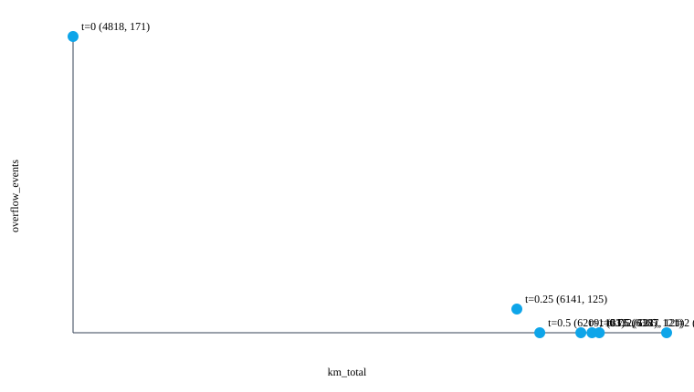

# 30-day predictive collection simulation

> **SIMULATED DATA.** This proves policy logic on a modeled Baikonur district; real savings must be measured during the pilot.

World: 250 sites in sector Өндіріс; real OSM records: 13; street-synthesized: 237.

Distance source: haversine (road-distance fallback, explicitly flagged).

Distance savings are never presented alone: overflow events and max-interval violations are shown in the same table.

| Policy | km_total | Δ vs fixed | overflow_events | max_interval_violations |
|---|---:|---:|---:|---:|
| fixed | 6165.77 | +0.0% | 237 | 50 |
| fixed_naive | 33493.19 | +443.2% | 237 | 50 |
| predictive | 5219.97 | -15.3% | 171 | 0 |
| predictive_reds_only | 5219.97 | -15.3% | 171 | 0 |

## All KPIs

| KPI | fixed | fixed_naive | predictive | predictive_reds_only |
|---|---:|---:|---:|---:|
| km_total | 6165.77 | 33493.19 | 5219.97 | 5219.97 |
| km_per_tonne | 11.12 | 60.41 | 9.67 | 9.67 |
| overflow_events | 237.00 | 237.00 | 171.00 | 171.00 |
| overflow_site_days | 31.60 | 31.60 | 22.80 | 22.80 |
| mean_fill_at_pickup | 46.53 | 46.53 | 70.30 | 70.30 |
| max_interval_violations | 50.00 | 50.00 | 0.00 | 0.00 |
| truck_hours | 570.38 | 1658.98 | 417.90 | 417.90 |
| fuel_liters | 2158.02 | 11722.62 | 1826.99 | 1826.99 |
| co2_kg | 5783.49 | 31416.61 | 4896.33 | 4896.33 |
| cost_kzt | 636615.79 | 3458171.75 | 538961.79 | 538961.79 |
| sites_served | 5480.00 | 5480.00 | 3562.00 | 3562.00 |

## Predictive delta vs fixed

| KPI | Delta |
|---|---:|
| km_total | -15.3% |
| km_per_tonne | -13.1% |
| overflow_events | -27.8% |
| overflow_site_days | -27.8% |
| mean_fill_at_pickup | +51.1% |
| max_interval_violations | -100.0% |
| truck_hours | -26.7% |
| fuel_liters | -15.3% |
| co2_kg | -15.3% |
| cost_kzt | -15.3% |
| sites_served | -35.0% |

## YELLOW_TOLERANCE trade-off sweep

| tolerance | km_total | km_per_tonne | overflow_events | overflow_site_days | mean_fill_at_pickup | max_interval_violations | truck_hours | fuel_liters | co2_kg | cost_kzt | sites_served |
|---:|---:|---:|---:|---:|---:|---:|---:|---:|---:|---:|---:|
| 0 | 5219.97 | 9.67 | 171.00 | 22.80 | 70.30 | 0.00 | 417.90 | 1826.99 | 4896.33 | 538961.79 | 3562.00 |
| 0.25 | 6502.60 | 11.78 | 124.00 | 16.53 | 43.20 | 0.00 | 634.55 | 2275.91 | 6099.44 | 671393.63 | 5864.00 |
| 0.5 | 6715.21 | 12.13 | 121.00 | 16.13 | 42.27 | 0.00 | 660.51 | 2350.32 | 6298.86 | 693345.20 | 6018.00 |
| 0.75 | 6719.52 | 12.15 | 122.00 | 16.27 | 42.30 | 0.00 | 650.43 | 2351.83 | 6302.91 | 693790.49 | 6008.00 |
| 1 | 6829.12 | 12.34 | 121.00 | 16.13 | 41.96 | 0.00 | 672.46 | 2390.19 | 6405.72 | 705106.79 | 6061.00 |
| 1.5 | 6957.26 | 12.57 | 121.00 | 16.13 | 41.99 | 0.00 | 671.34 | 2435.04 | 6525.91 | 718336.72 | 6056.00 |
| 2 | 7064.73 | 12.76 | 121.00 | 16.13 | 41.92 | 0.00 | 679.19 | 2472.66 | 6626.72 | 729433.43 | 6067.00 |

**Selected default: `YELLOW_TOLERANCE = 0`.** 0 is the largest tested tolerance below fixed on both total distance and overflow events.
