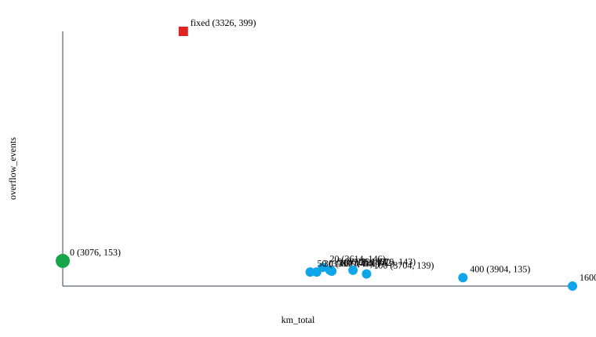

# 30-day predictive collection simulation

> **SIMULATED DATA.** This proves policy logic on a modeled Baikonur district; real savings must be measured during the pilot.

Routing profile: **refuse_truck** (from committed road-cache metadata).

Courtyard access: **площадок без картированного подъезда: 0 (0.0%).**

World: 250 sites in sector Жастар.

**Sector boundary validated: 250 of 250 sites (100.0%) are inside the Жастар polygon.**

**Реальных площадок из OSM: 5 из 250; остальные размещены на реальных улицах.**

Area-type composition: mixed: 194 (77.6%), multistorey: 49 (19.6%), private: 7 (2.8%).

The fixed baseline is a compliant, idealised calendar. A real operator also reacts to complaints, so actual current practice lies somewhere between fixed and predictive.

Distance source: road_cache.

Distance savings are never presented alone: overflow events and max-interval violations are shown in the same table.

| Policy | km_total | Δ vs fixed | overflow_events | max_interval_violations |
|---|---:|---:|---:|---:|
| fixed | 3325.51 | +0.0% | 399 | 0 |
| fixed_naive | 15998.79 | +381.1% | 399 | 0 |
| predictive | 3076.03 | -7.5% | 153 | 0 |
| predictive_reds_only | 3076.03 | -7.5% | 153 | 0 |

## All KPIs

| KPI | fixed | fixed_naive | predictive | predictive_reds_only |
|---|---:|---:|---:|---:|
| km_total | 3325.51 | 15998.79 | 3076.03 | 3076.03 |
| km_per_tonne | 6.85 | 32.98 | 6.41 | 6.41 |
| overflow_events | 399.00 | 399.00 | 153.00 | 153.00 |
| overflow_site_days | 53.20 | 53.20 | 20.40 | 20.40 |
| mean_fill_at_pickup | 51.57 | 51.57 | 67.92 | 67.92 |
| max_interval_violations | 0.00 | 0.00 | 0.00 | 0.00 |
| truck_hours | 386.05 | 732.50 | 320.30 | 320.30 |
| fuel_liters | 1163.93 | 5599.58 | 1076.61 | 1076.61 |
| co2_kg | 3119.32 | 15006.87 | 2885.32 | 2885.32 |
| cost_kzt | 343358.48 | 1651875.42 | 317600.36 | 317600.36 |
| sites_served | 4450.00 | 4450.00 | 3353.00 | 3353.00 |

## Predictive delta vs fixed

| KPI | Delta |
|---|---:|
| km_total | -7.5% |
| km_per_tonne | -6.4% |
| overflow_events | -61.7% |
| overflow_site_days | -61.7% |
| mean_fill_at_pickup | +31.7% |
| max_interval_violations | +0.0% |
| truck_hours | -17.0% |
| fuel_liters | -7.5% |
| co2_kg | -7.5% |
| cost_kzt | -7.5% |
| sites_served | -24.7% |

**Yellow rule is inert at the selected default:** predictive and predictive_reds_only are identical on distance, overflow, and sites served. **Жёлтые баки на текущей настройке не собираются.**

## Marginal YELLOW detour-budget trade-off sweep

| detour_budget_m_per_m3 | km_total | km_per_tonne | overflow_events | overflow_site_days | mean_fill_at_pickup | max_interval_violations | truck_hours | fuel_liters | co2_kg | cost_kzt | sites_served |
|---:|---:|---:|---:|---:|---:|---:|---:|---:|---:|---:|---:|
| 0 | 3076.03 | 6.41 | 153.00 | 20.40 | 67.92 | 0.00 | 320.30 | 1076.61 | 2885.32 | 317600.36 | 3353.00 |
| 5 | 3628.61 | 7.48 | 143.00 | 19.07 | 57.91 | 0.00 | 376.53 | 1270.01 | 3403.64 | 374654.08 | 3958.00 |
| 10 | 3632.51 | 7.48 | 142.00 | 18.93 | 57.26 | 0.00 | 378.57 | 1271.38 | 3407.30 | 375056.73 | 4008.00 |
| 20 | 3613.77 | 7.46 | 146.00 | 19.47 | 57.28 | 0.00 | 377.97 | 1264.82 | 3389.72 | 373121.65 | 3997.00 |
| 30 | 3601.28 | 7.44 | 141.00 | 18.80 | 56.66 | 0.00 | 378.50 | 1260.45 | 3378.00 | 371832.51 | 4040.00 |
| 50 | 3587.75 | 7.38 | 141.00 | 18.80 | 55.77 | 0.00 | 382.02 | 1255.71 | 3365.31 | 370435.09 | 4115.00 |
| 75 | 3676.26 | 7.56 | 143.00 | 19.07 | 54.85 | 0.00 | 389.97 | 1286.69 | 3448.33 | 379574.04 | 4184.00 |
| 100 | 3704.30 | 7.60 | 139.00 | 18.53 | 54.19 | 0.00 | 394.48 | 1296.51 | 3474.63 | 382469.03 | 4242.00 |
| 400 | 3903.71 | 7.96 | 135.00 | 18.00 | 47.43 | 0.00 | 440.05 | 1366.30 | 3661.68 | 403058.29 | 4867.00 |
| 1600 | 4130.30 | 8.42 | 126.00 | 16.80 | 41.63 | 0.00 | 485.62 | 1445.60 | 3874.22 | 426453.32 | 5554.00 |

**Selected default: `DETOUR_BUDGET_M_PER_M3 = 0`.** 0 m/m³ is the largest tested detour budget below fixed on both measures: 3076.0 km and 153 overflow events versus fixed at 3325.5 km and 399.

## Fleet adequacy

**No tested operating point reaches zero overflow.** The best tested configuration records 126 overflow events (16.80 per 1000 site-days) at 1600 m/m³. **Текущий парк недостаточен для нулевого переполнения при смоделированных ограничениях смены и маршрутизации.**
